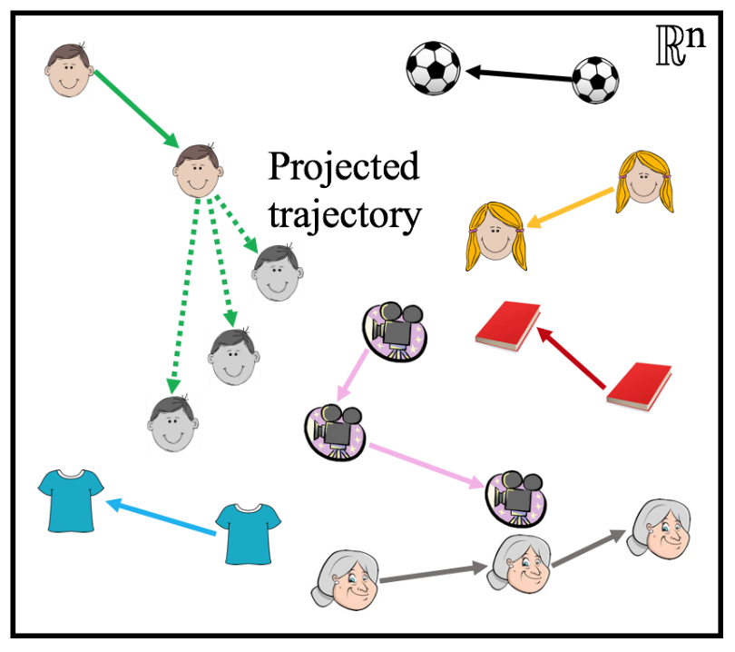
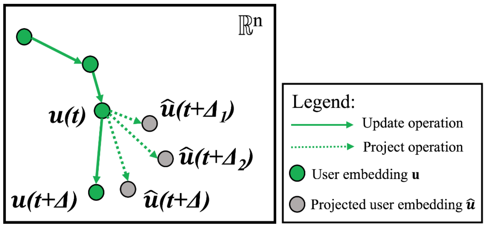

:::{.hidden}
\newcommand{\norm}[1]{\left\lVert#1\right\rVert}
:::

Recommender systems are an important application of ML on graphs, and a lot of thought has been put into the development of technology to do recommendation well. A central problem in the sphere is dealing with the modeling of sequential interactions between users and items. The items could be products in e-commerce, but also pins on Pinterest, tweets on Twitter, or course contents in Coursera. The paper [@Kumar_2019] introduces JODIE, a popular method in the field which has turned into a common benchmark. Some of the challenges it addresses are:

    1. User behaviour changes in time.
    2. Data is fed in as a sequence of interactions.
    3. Interactions have to be processed in sequence, so how do you parallelise?

Consider the example of a social media. These platforms want to be able to successfully predict what content the users will interact with, so that they can recommend similar content and maximise engagement. In the JODIE model, each user has a stationary property $\overline{\mathbf{u}}$, and a time-evolving property $\mathbf{u}(t)$. This is easy to intuit since people tend to have long-term stable preferences, but their daily and weekly interests can vary. Even cat videos can get boring if that's all you see, but if you are a person who likes animals, then there are other similar recommendations that will catch your interest. The same argument is applied to the items, and we denote $\overline{\mathbf{i}}$, $\mathbf{i}(t)$ as the stationary and time-evolving representations respectively. 

::: {layout-ncol=2}

{width=300}

{width=350}

:::

The observed data is the sequence of interactions $S_r = (u_r, i_r, t_r, \mathbf{f}_r)$, where $u_r$, $i_r$ are the user and item interacting, $t_r$ is the timestamp, and $\mathbf{f}_r$ is a feature vector associated with the interaction.  Once a new interaction is observed, the time-evolving embeddings of the participating entities are updated using a recurrent network:

\begin{equation}
    \mathbf{u}(t) = \sigma(W_1^{u}\mathbf{u}(t^{-}) + W_2^{u}\mathbf{i}(t^{-}) + W_3^{u}\mathbf{f} + W_4^{u}\Delta_u)
\end{equation}

\begin{equation}
    \mathbf{i}(t) = \sigma(W_1^{i}\mathbf{i}(t^{-}) + W_2^{i}\mathbf{u}(t^{-}) + W_3^{i}\mathbf{f} + W_4^{i}\Delta_i)
\end{equation}

Where the interaction occurs at time $t$, $\mathbf{u}(t^{-})$ and $\mathbf{i}(t^{-})$ represent the latest embeddings before the current interaction, and $W$ are learnable parameters. The $\Delta$ represent the elapsed time from the last interaction of the entity. Note that the RNNs are trained to predict the embedding of the *item* at $u$'s next interaction (will come back to this). This step is referred to as the **update operation**.

There are two more steps to predicting which item the user will interact with. The first step involves predicting the user embedding trajectory into the future, and is called **project operation**. The projected embedding $\hat{\mathbf{u}}(t + \Delta)$ is used in the downstream task. In the JODIE model, the user trajectory evolves continuously in time, so for an arbitrarily small $\Delta$, the projected embedding is arbitrarily close to the starting point. With time, the projection drifts farther away. The $*$ operator is a Hamadard product, and $W_p$ converts $\Delta$ to a "time-context vector". They also call $W_p\Delta$ a temporal attention vector. The project operation aims to predict the user's preferences in the future, and it is also used to predict the most likely item the user will interact with.

\begin{equation}
    \hat{\mathbf{u}}(t + \Delta) = (1 + W_p\Delta) * \mathbf{u}(t)
\end{equation}

{width=500}

Finally, let user $u$ interact with item $i$ at time $t$, and item $j$ at time $t + \Delta$. At time $t$ can we predict which item $u$ will interact with at $t + \Delta$? A crucial design decision if that JODIE outputs an item embedding vector $\tilde{\mathbf{j}}(t + \Delta)$, instead of an interaction probability between all items. The motivation is that the model has to work on huge datasets, and pairwise probability does not scale well. 

\begin{equation}
    \tilde{\mathbf{j}}(t + \Delta) = W_1 \hat{\mathbf{u}}(t + \Delta) + W_2 \overline{\mathbf{u}} + W_3\mathbf{i}(t + \Delta^{-}) + W_4\overline{\mathbf{i}} + \mathbf{B}
\end{equation}

Outputting $\tilde{\mathbf{j}}$ means [Locality Sensitive Hashing](https://en.wikipedia.org/wiki/Locality-sensitive_hashing) (LSH) techniques can be used, and the nearest neighbour can be retreived in near-constant time. Note that to compute $\tilde{\mathbf{j}}$, the embedding $\mathbf{i}(t + \Delta^{-})$ is used, which is the latest embedding of the *last item* that the user $u$ interacted with. The rationale of including $\mathbf{i}(t + \Delta^{-})$ is that the last item's embedding might have been updated due to interacting with other users, and thus contains new information. Another point of interest in recommendation is that users tend to interact with the same items repeatedly, thus including this information adds useful information.

The training objective minimises the L2 loss between the $\tilde{\mathbf{j}}$ and the item the user really interacts with at $t + \Delta$.

\begin{equation}
    \texttt{L} = \sum_{S_r \in S} \norm{ 
    \tilde{\mathbf{j}}(t) - [\overline{\mathbf{i}}, \mathbf{i}(t^{-})] }^2 + \\
    \lambda_U\norm{\mathbf{u}(t) - \mathbf{u}(t^{-})}^2 + \lambda_I\norm{\mathbf{i}(t) - \mathbf{i}(t^{-})}^2
\end{equation}

In the above equation, $[\cdot, \cdot]$ is the concatenation operator, and $\lambda_{U}$, $\lambda_{I}$ weigh the regularisation. The regularisation ensures that the updated embeddings do not vary too greatly from the initial embeddings.

How do we parallelise the training? One extreme is to process each interaction in sequence of occurrence, but this would not scale to massive interaction graphs. Another extreme would be to randomly subsample a set of interactions and process them in parallel, but this is not viable, because the model is recurrent, and the sequence of processed batches must respect the temporal order of interactions. This is because the user and item embeddings also act as the hidden states of the RNN, and they persist between batches, so you don't want to update a user's embedding with interactions that are out of order - the model would be unable to learn the temporal dependency.
A nice property of the model is that two interactions that occur between two distinct user-item pairs could be ran together in parallel, as they would not influence each other's embeddings. Keeping this in mind, and respecting the temporal order of interactions, the paper introduces the *t-batch* algorithm. This algorithm assigns all $|\mathcal{I}|$ interactions to $B_k$ batches, where $k \in [1, |\mathcal{I}|]$. Each batch contains user-item interactions such that each user and item appear only once. The interactions contained in two batches will also be in order.

{width=400}

At the time when the paper was published, JODIE achieved SOTA performance. Nowadays it acts as a strong benchmark. We summarised how the model deals with the time evolving user behaviour, and how it is trained. The model should work well in an online production setting, as it can constantly update user and item state as new observations come in. Maybe that would reduce the need for re-training, and might be a good way to address the changing trends in online media, without worrying as much about distribution shift. The t-batch algorithm is also an interesting way to optimise training. In my prior experience, training models on sequential data poses unique challenges, as we saw above, so it is interesting to see how some methods address them. 

### References

::: {#refs}
:::
